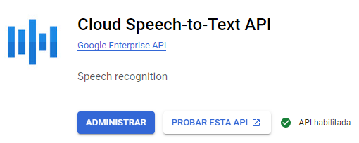
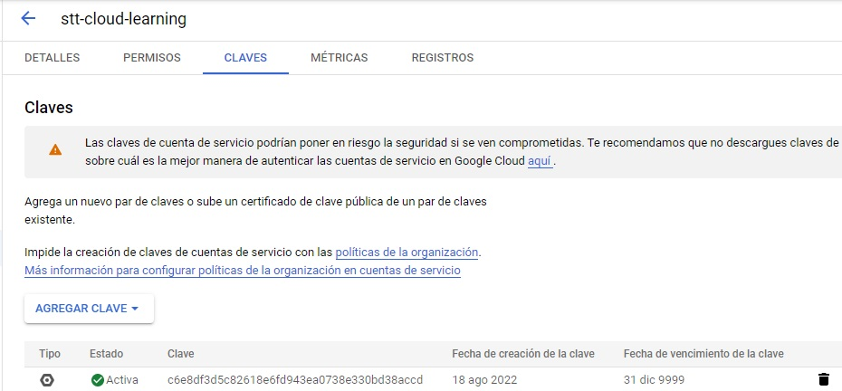

# STT Cloud Learning

🎯 Objective: Learn how to record audio in Web and send to Machine Learning Cloud Approachs in order to transform Speech to text
📖 TO DO:
- Grab the Record from the index.html and send to *GCloud Speech to text* and receive the Text, then Show it
- Grab the Record from the index.html and send to *AWS Transcribe* and receive the Text, then Show it
- Make a little refactor and use Vue3 for the Interface to show the notes.

# Getting Started

Run
```bash
npm i
npm run start:dev
```
to launch index.html and go to http://localhost:3000/*

The Snippet about how to Get Permission of Mic and Start/Stop was taken from:
[CodePen](https://codepen.io/Sambego/pen/ZBPbbR)

The Approach about how to send in correct way the BLOB to Backend was taken from here:
[Fetch API upload file](https://openjavascript.info/2022/06/08/how-to-upload-a-file-using-the-fetch-api/)

The Documentation to Remember how to use the Multer Interceptor from Express and File Interceptor from Nest
[File Upload Nest](https://docs.nestjs.com/techniques/file-upload)


# Enabling GCloud API
You must have an GCloud Account with billing enabled
Enter here:
[Enable API](https://console.cloud.google.com/apis/enableflow?apiid=texttospeech.googleapis.com&authuser=1)

Then go to 
[Cloud Speech-to-Text API](https://console.cloud.google.com/marketplace/product/google/speech.googleapis.com?q=search&referrer=search&authuser=1&project=webpage-9a255)

And you should be the api enabled:


Also Remember the prices
Free Tier: Till 60 minutes/month
Level 1: USD 0.024/Minute

## Create ServiceAccount and get a JSON Credential


To Test locally, export as Variable:
```bash
export GOOGLE_APPLICATION_CREDENTIALS=/home/eddyalien/webpage-9a255-c6e8df3d5c82.json
```

For this Test I have tested with 'es-MX' language.
The response of the API is the following:
```json
{
   "results":[
      {
         "alternatives":[
            {
               "words":[
                  
               ],
               "transcript":"Okay vamos a probar esto no tiene más de 5 segundos",
               "confidence":0.9308170676231384
            }
         ],
         "channelTag":0,
         "resultEndTime":{
            "seconds":"5",
            "nanos":50000000
         },
         "languageCode":"es-us"
      }
   ],
   "totalBilledTime":{
      "seconds":"15",
      "nanos":0
   }
}
```

> As I can see, minimum Billing GCloud takes is *15 seconds* yet if the audio is 5, for example.

Finally, Google Cloud Documentation is a little bit spreat for many places.
Most useful to fix my issues was here:
[google.cloud.speech.v1](https://cloud.google.com/speech-to-text/docs/reference/rpc/google.cloud.speech.v1#google.cloud.speech.v1.StreamingRecognitionConfig)

And a little introduction but useful
[Converting speech to text with Node.js](https://youtu.be/naZ8oEKuR44)